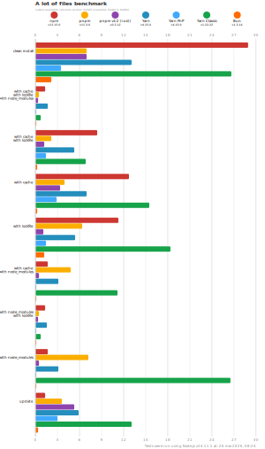
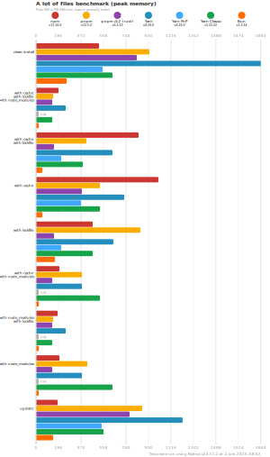
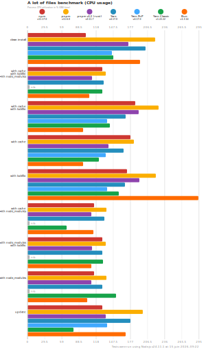
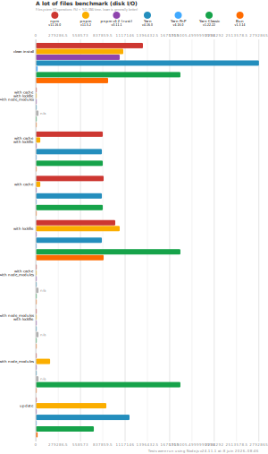
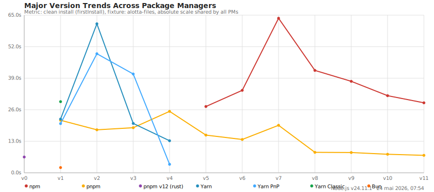

## Package manager benchmarks

Automated benchmarks for JavaScript package managers.

Based on the original benchmark project: https://pnpm.io/benchmarks

## Run locally

```bash
pnpm install
pnpm run benchmarks
```

## Results

### Fixture snapshots

#### A lot of files





### Version trends by package manager

