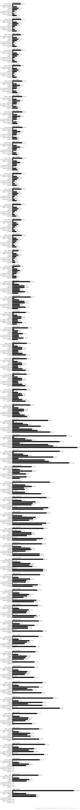
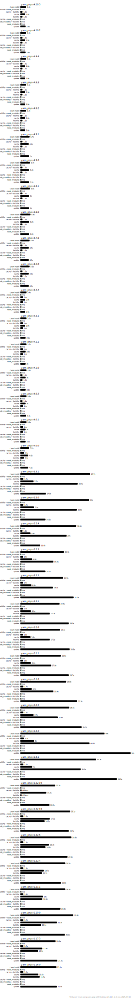
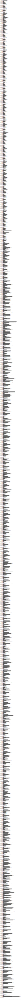
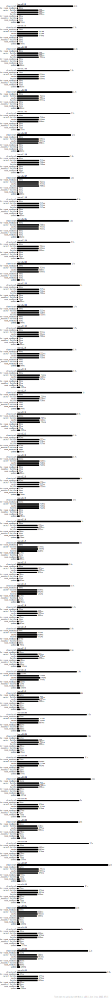

## Usage

```
pnpm install
pnpm run benchmark
```

## Results

[See detailed benchmarks](./benchmarks.md)
[NPM](#npm)
[Yarn](#yarn)
[Yarn PnP](#yarn-pnp)
[PnPM](#pnpm)
[Bun](#bun)

#### A lot of files


#### Angular quickstart


#### Ember quickstart


#### React app


#### Medium size app


### NPM


### Yarn



### Yarn PnP



### PnPM



### Bun


