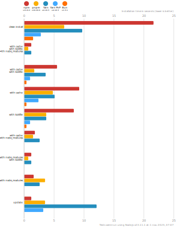

# Benchmarks of JavaScript Package Managers

**Last benchmarked at**: _30 oct. 2025, 07:07_ (_daily_ updated).

This benchmark compares the performance of npm, pnpm, Yarn Classic, Yarn PnP, and Bun (check [Yarn's benchmarks](https://yarnpkg.com/benchmarks) for any other Yarn modes that are not included here).

Here's a quick explanation of how these tests could apply to the real world:

- `clean install`: How long it takes to run a totally fresh install: no lockfile present, no packages in the cache, no `node_modules` folder.
- `with cache`, `with lockfile`, `with node_modules`: After the first install is done, the install command is run again.
- `with cache`, `with lockfile`: When a repo is fetched by a developer and installation is first run.
- `with cache`: Same as the one above, but the package manager doesn't have a lockfile to work from.
- `with lockfile`: When an installation runs on a CI server.
- `with cache`, `with node_modules`: The lockfile is deleted and the install command is run again.
- `with node_modules`, `with lockfile`: The package cache is deleted and the install command is run again.
- `with node_modules`: The package cache and the lockfile is deleted and the install command is run again.
- `update`: Updating your dependencies by changing the version in the `package.json` and running the install command again.

## React App

The app's `package.json` [here](./fixtures/react-app/package.json)

| action  | cache | lockfile | node_modules| npm | pnpm | Yarn | Yarn PnP | Bun |
| ---     | ---   | ---      | ---         | --- | ---  | ---  | ---      | --- |
| install |       |          |             | 21.6s | 7.3s | 9.6s | 2.7s | 1.5s |
| install | ✔     | ✔        | ✔           | 1.2s | 652ms | 1.1s | n/a | 34ms |
| install | ✔     | ✔        |             | 5.5s | 1.7s | 3.5s | 990ms | 436ms |
| install | ✔     |          |             | 9.2s | 4.8s | 5.1s | 2.3s | 416ms |
| install |       | ✔        |             | 8.3s | 3.7s | 3.6s | 983ms | 415ms |
| install | ✔     |          | ✔           | 1.7s | 1.5s | 2.6s | n/a | 34ms |
| install |       | ✔        | ✔           | 1.2s | 690ms | 1.2s | n/a | 31ms |
| install |       |          | ✔           | 1.6s | 3.7s | 2.6s | n/a | 31ms |
| update  | n/a | n/a | n/a | 1.2s | 3.7s | 12.1s | 3.1s | 34ms |

## Ember App

The app's `package.json` [here](./fixtures/ember-quickstart/package.json)

| action  | cache | lockfile | node_modules| npm | pnpm | Yarn | Yarn PnP | Bun |
| ---     | ---   | ---      | ---         | --- | ---  | ---  | ---      | --- |
| install |       |          |             | 20s | 5.3s | 5.7s | 2.3s | 1.1s |
| install | ✔     | ✔        | ✔           | 950ms | 582ms | 1s | n/a | 27ms |
| install | ✔     | ✔        |             | 4.2s | 1.4s | 2.7s | 860ms | 328ms |
| install | ✔     |          |             | 6.9s | 3.8s | 3.9s | 2s | 326ms |
| install |       | ✔        |             | 6.4s | 3s | 2.7s | 859ms | 326ms |
| install | ✔     |          | ✔           | 1.2s | 1.2s | 2.1s | n/a | 26ms |
| install |       | ✔        | ✔           | 948ms | 568ms | 1s | n/a | 24ms |
| install |       |          | ✔           | 1.2s | 2.9s | 2.1s | n/a | 24ms |
| update  | n/a | n/a | n/a | 947ms | 2.8s | 7.8s | 2.8s | 27ms |

## Angular App

The app's `package.json` [here](./fixtures/angular-quickstart/package.json)

| action  | cache | lockfile | node_modules| npm | pnpm | Yarn | Yarn PnP | Bun |
| ---     | ---   | ---      | ---         | --- | ---  | ---  | ---      | --- |
| install |       |          |             | 23.6s | 7.1s | 10.7s | 2.8s | 1.7s |
| install | ✔     | ✔        | ✔           | 900ms | 682ms | 1.3s | n/a | 28ms |
| install | ✔     | ✔        |             | 9.4s | 1.8s | 5.2s | 1.2s | 840ms |
| install | ✔     |          |             | 12.7s | 4.8s | 6.5s | 2.3s | 818ms |
| install |       | ✔        |             | 11.7s | 4s | 5.2s | 1.2s | 823ms |
| install | ✔     |          | ✔           | 1.7s | 1.5s | 2.5s | n/a | 28ms |
| install |       | ✔        | ✔           | 899ms | 661ms | 1.3s | n/a | 25ms |
| install |       |          | ✔           | 1.7s | 4.9s | 2.5s | n/a | 25ms |
| update  | n/a | n/a | n/a | 903ms | 3.2s | 10s | 2.7s | 33ms |

## Medium Size App

The app's `package.json` [here](./fixtures/medium-size-app/package.json)

| action  | cache | lockfile | node_modules| npm | pnpm | Yarn | Yarn PnP | Bun |
| ---     | ---   | ---      | ---         | --- | ---  | ---  | ---      | --- |
| install |       |          |             | 24.4s | 6.7s | 7.5s | 2.9s | 1.6s |
| install | ✔     | ✔        | ✔           | 1.2s | 639ms | 1.3s | n/a | 31ms |
| install | ✔     | ✔        |             | 7.3s | 1.8s | 4s | 1.1s | 482ms |
| install | ✔     |          |             | 10.5s | 4.7s | 5.5s | 2.5s | 474ms |
| install |       | ✔        |             | 9.7s | 4s | 4.1s | 1.1s | 457ms |
| install | ✔     |          | ✔           | 1.6s | 1.5s | 2.7s | n/a | 31ms |
| install |       | ✔        | ✔           | 1.1s | 626ms | 1.3s | n/a | 28ms |
| install |       |          | ✔           | 1.6s | 4.1s | 2.7s | n/a | 28ms |
| update  | n/a | n/a | n/a | 1.2s | 3.4s | 5.4s | 2.4s | 39ms |

## Lots of Files

The app's `package.json` [here](./fixtures/alotta-files/package.json)

| action  | cache | lockfile | node_modules| npm | pnpm | Yarn | Yarn PnP | Bun |
| ---     | ---   | ---      | ---         | --- | ---  | ---  | ---      | --- |
| install |       |          |             | 34.6s | 9s | 10.1s | 3.4s | 1.7s |
| install | ✔     | ✔        | ✔           | 1.2s | 690ms | 1.5s | n/a | 40ms |
| install | ✔     | ✔        |             | 8.4s | 2.3s | 5.5s | 1.3s | 696ms |
| install | ✔     |          |             | 12.7s | 5.6s | 7.2s | 2.8s | 693ms |
| install |       | ✔        |             | 11.3s | 5s | 5.6s | 1.3s | 690ms |
| install | ✔     |          | ✔           | 1.7s | 2s | 3s | n/a | 38ms |
| install |       | ✔        | ✔           | 1.2s | 681ms | 1.5s | n/a | 35ms |
| install |       |          | ✔           | 1.7s | 5.5s | 3s | n/a | 35ms |
| update  | n/a | n/a | n/a | 1.2s | 4.2s | 5.3s | 2.9s | 93ms |

