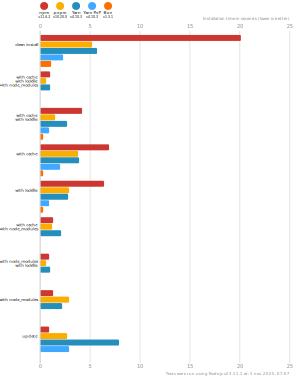

# Benchmarks of JavaScript Package Managers

**Last benchmarked at**: _11 févr. 2025, 07:07_ (_daily_ updated).

This benchmark compares the performance of npm, pnpm, Yarn Classic, Yarn PnP, and Bun (check [Yarn's benchmarks](https://yarnpkg.com/benchmarks) for any other Yarn modes that are not included here).

Here's a quick explanation of how these tests could apply to the real world:

- `clean install`: How long it takes to run a totally fresh install: no lockfile present, no packages in the cache, no `node_modules` folder.
- `with cache`, `with lockfile`, `with node_modules`: After the first install is done, the install command is run again.
- `with cache`, `with lockfile`: When a repo is fetched by a developer and installation is first run.
- `with cache`: Same as the one above, but the package manager doesn't have a lockfile to work from.
- `with lockfile`: When an installation runs on a CI server.
- `with cache`, `with node_modules`: The lockfile is deleted and the install command is run again.
- `with node_modules`, `with lockfile`: The package cache is deleted and the install command is run again.
- `with node_modules`: The package cache and the lockfile is deleted and the install command is run again.
- `update`: Updating your dependencies by changing the version in the `package.json` and running the install command again.

## React App

The app's `package.json` [here](./fixtures/react-app/package.json)

| action  | cache | lockfile | node_modules| npm | pnpm | Yarn | Yarn PnP | Bun |
| ---     | ---   | ---      | ---         | --- | ---  | ---  | ---      | --- |
| install |       |          |             | 19.1s | 5.8s | 9.6s | 4.5s | 1.3s |
| install | ✔     | ✔        | ✔           | 1.2s | 807ms | 1.1s | n/a | 36ms |
| install | ✔     | ✔        |             | 5s | 1.8s | 3.4s | 962ms | 444ms |
| install | ✔     |          |             | 8.3s | 4.5s | 6.7s | 4.1s | 433ms |
| install |       | ✔        |             | 7.3s | 3.4s | 3.5s | 957ms | 418ms |
| install | ✔     |          | ✔           | 1.4s | 1.6s | 4.4s | n/a | 35ms |
| install |       | ✔        | ✔           | 1.2s | 806ms | 1.1s | n/a | 32ms |
| install |       |          | ✔           | 1.4s | 3.2s | 4.4s | n/a | 32ms |
| update  | n/a | n/a | n/a | 1.2s | 3.4s | 12.7s | 6.2s | 36ms |

## Ember App

The app's `package.json` [here](./fixtures/ember-quickstart/package.json)

| action  | cache | lockfile | node_modules| npm | pnpm | Yarn | Yarn PnP | Bun |
| ---     | ---   | ---      | ---         | --- | ---  | ---  | ---      | --- |
| install |       |          |             | 19.3s | 4.8s | 6.5s | 3.6s | 962ms |
| install | ✔     | ✔        | ✔           | 1s | 721ms | 989ms | n/a | 28ms |
| install | ✔     | ✔        |             | 3.7s | 1.5s | 2.6s | 848ms | 351ms |
| install | ✔     |          |             | 6.1s | 3.5s | 5.1s | 3.2s | 352ms |
| install |       | ✔        |             | 5.6s | 2.8s | 2.7s | 854ms | 329ms |
| install | ✔     |          | ✔           | 1.1s | 1.2s | 3.4s | n/a | 27ms |
| install |       | ✔        | ✔           | 946ms | 694ms | 994ms | n/a | 25ms |
| install |       |          | ✔           | 1s | 2.7s | 3.4s | n/a | 25ms |
| update  | n/a | n/a | n/a | 941ms | 2.6s | 8.8s | 4.6s | 28ms |

## Angular App

The app's `package.json` [here](./fixtures/angular-quickstart/package.json)

| action  | cache | lockfile | node_modules| npm | pnpm | Yarn | Yarn PnP | Bun |
| ---     | ---   | ---      | ---         | --- | ---  | ---  | ---      | --- |
| install |       |          |             | 20.1s | 6.1s | 11.8s | 4.5s | 1.7s |
| install | ✔     | ✔        | ✔           | 910ms | 791ms | 1.3s | n/a | 30ms |
| install | ✔     | ✔        |             | 7.7s | 1.9s | 5.2s | 1.2s | 868ms |
| install | ✔     |          |             | 10.7s | 4.3s | 8.1s | 4s | 841ms |
| install |       | ✔        |             | 9.7s | 4s | 5.2s | 1.2s | 842ms |
| install | ✔     |          | ✔           | 1s | 1.5s | 4.1s | n/a | 29ms |
| install |       | ✔        | ✔           | 895ms | 802ms | 1.3s | n/a | 27ms |
| install |       |          | ✔           | 1s | 3.8s | 4.2s | n/a | 27ms |
| update  | n/a | n/a | n/a | 895ms | 3.2s | 9.8s | 4.2s | 34ms |

## Medium Size App

The app's `package.json` [here](./fixtures/medium-size-app/package.json)

| action  | cache | lockfile | node_modules| npm | pnpm | Yarn | Yarn PnP | Bun |
| ---     | ---   | ---      | ---         | --- | ---  | ---  | ---      | --- |
| install |       |          |             | 20.6s | 5.7s | 8.8s | 4.6s | 1.5s |
| install | ✔     | ✔        | ✔           | 1.2s | 770ms | 1.3s | n/a | 33ms |
| install | ✔     | ✔        |             | 5.9s | 1.9s | 4s | 1.1s | 481ms |
| install | ✔     |          |             | 8.9s | 4.6s | 7.1s | 4.1s | 465ms |
| install |       | ✔        |             | 8s | 3.8s | 4s | 1.1s | 456ms |
| install | ✔     |          | ✔           | 1.4s | 1.6s | 4.3s | n/a | 32ms |
| install |       | ✔        | ✔           | 1.1s | 769ms | 1.3s | n/a | 30ms |
| install |       |          | ✔           | 1.4s | 3.6s | 4.4s | n/a | 29ms |
| update  | n/a | n/a | n/a | 1.1s | 3.2s | 6.8s | 4.1s | 40ms |

## Lots of Files

The app's `package.json` [here](./fixtures/alotta-files/package.json)

| action  | cache | lockfile | node_modules| npm | pnpm | Yarn | Yarn PnP | Bun |
| ---     | ---   | ---      | ---         | --- | ---  | ---  | ---      | --- |
| install |       |          |             | 28.5s | 7.3s | 11.6s | 5.5s | 1.7s |
| install | ✔     | ✔        | ✔           | 1.3s | 817ms | 1.5s | n/a | 41ms |
| install | ✔     | ✔        |             | 7.6s | 2.4s | 5.5s | 1.3s | 719ms |
| install | ✔     |          |             | 11.4s | 5.2s | 9.2s | 4.9s | 710ms |
| install |       | ✔        |             | 10.1s | 4.8s | 5.5s | 1.3s | 711ms |
| install | ✔     |          | ✔           | 1.5s | 2s | 5.1s | n/a | 41ms |
| install |       | ✔        | ✔           | 1.2s | 821ms | 1.5s | n/a | 38ms |
| install |       |          | ✔           | 1.5s | 5s | 5.1s | n/a | 37ms |
| update  | n/a | n/a | n/a | 1.2s | 3.9s | 6.2s | 4.9s | 88ms |

